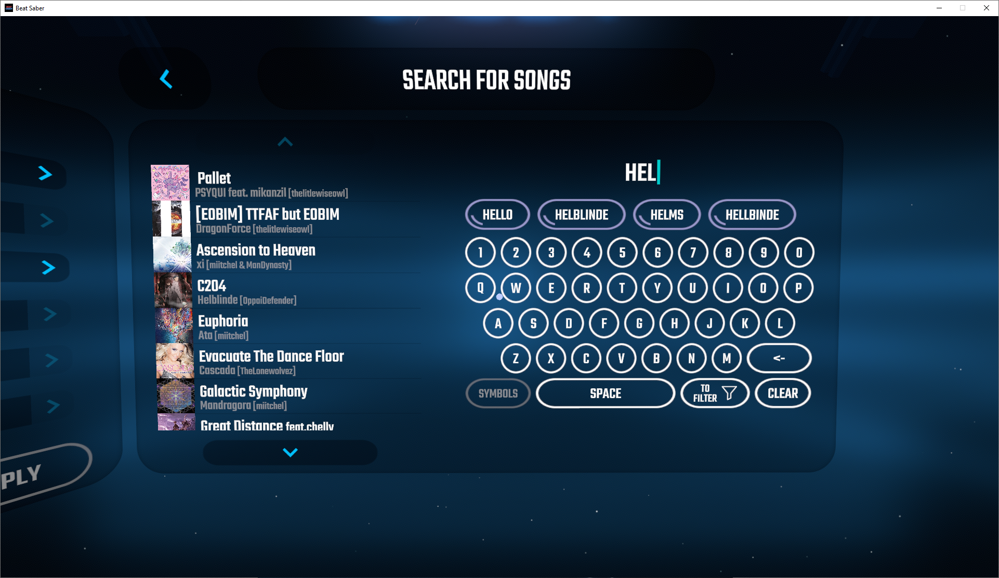
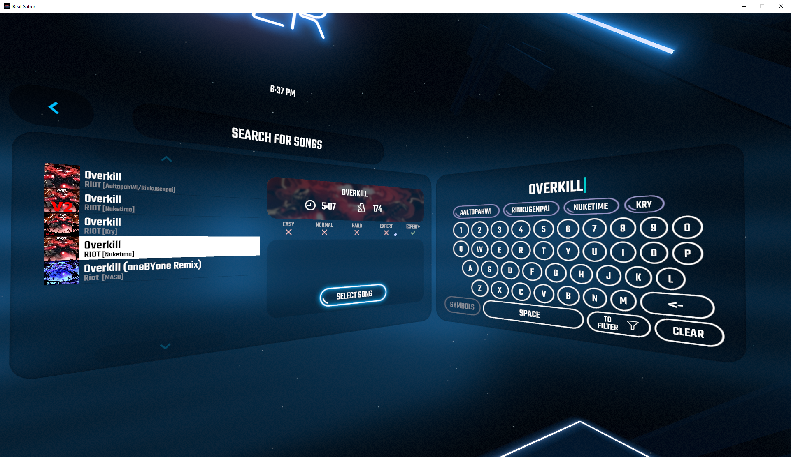
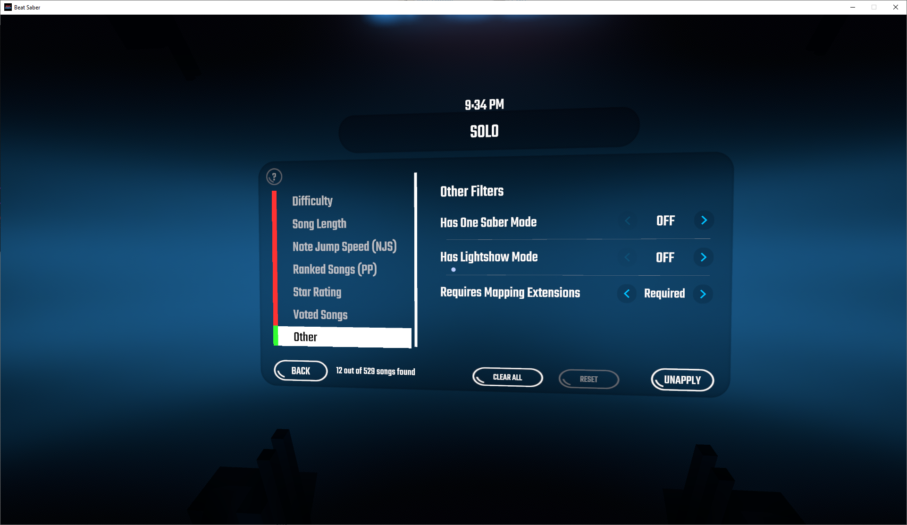
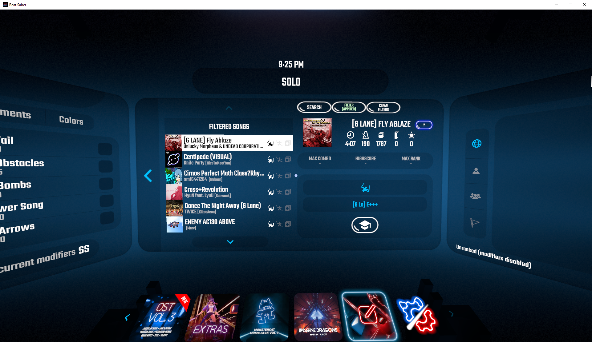

# EnhancedSearchAndFilters

A mod that helps you find the songs you want to play quicker! Includes a more option-rich search screen and song filtering. The latest version of this mod can be found [here](https://github.com/chrislee0419/EnhancedSearchAndFilters/releases).

### Have an issue?

_**If you have any suggestions or found any bugs**_, please report it [here](https://github.com/chrislee0419/EnhancedSearchAndFilters/issues) or through Discord by sending a message to `chris#9068`.

## Features

- Search
     - Auto-refreshing search results
       - Now you don't have to enter the whole title of a song and hope it appears in the search results! You can see what songs match as you're typing it in.
     - Search by song title, author, and map maker
       - Never search for artists or map makers? Further refine your search results when you disable searching in those fields.
     - Symbols
       - Apostrophes, quotation marks, commas, brackets, etc. can be removed before searching.
       - Or alternatively, symbols can be typed in yourself when trying to find a song with lots of symbols in the title!
     - Word suggestions
       - While typing, the mod shows you a list of possible words you're trying to type.
- Filter
     - Limit song length, difficulties, and NJS on the song list.
     - Find songs you have voted on (requires the BeatSaverDownloader mod).
     - One Saber, Lightshow, and Mapping Extensions-required songs can be easily found!
     - Show only ranked songs (requires the SongDataCore mod).
     - Frequently download songs and then forget to play them? Filter for songs that you have never played before.
     - Looking to full combo all your songs? Find all the songs that you have yet to full combo!
- Mod compatibility
     - Compatible with BeatSaverDownloader, SongBrowser, and SongDataCore.

## Dependencies

- SongCore
- CustomUI
- BS Utils

## Screenshots

## Icon Credits

Filter icon made by [Freepik](https://www.freepik.com/) on [www.flaticon.com](https://www.flaticon.com/), modified with colours inverted.

Checkmark icon made by [Silviu Runceanu](https://www.flaticon.com/authors/silviu-runceanu) on [www.flaticon.com](https://www.flaticon.com/), modified with colours inverted (licensed under [CC BY 3.0](https://creativecommons.org/licenses/by/3.0/)).

Cross icon made by [Silviu Runceanu](https://www.flaticon.com/authors/silviu-runceanu) on [www.flaticon.com](https://www.flaticon.com/), modified with colours inverted (licensed under [CC BY 3.0](https://creativecommons.org/licenses/by/3.0/)).

