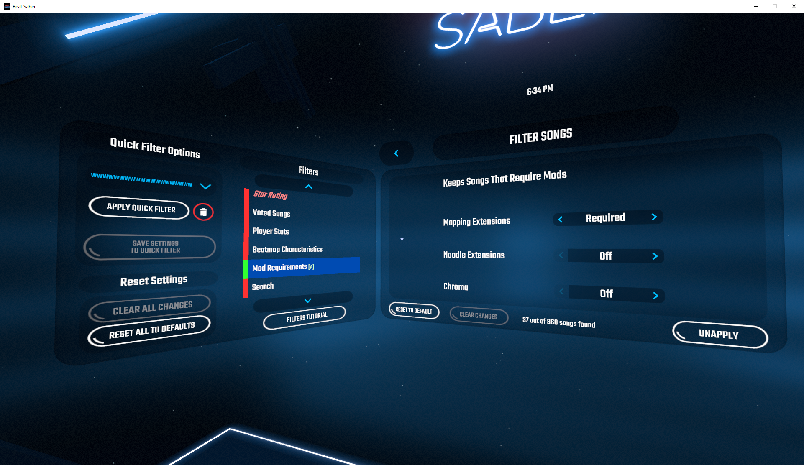
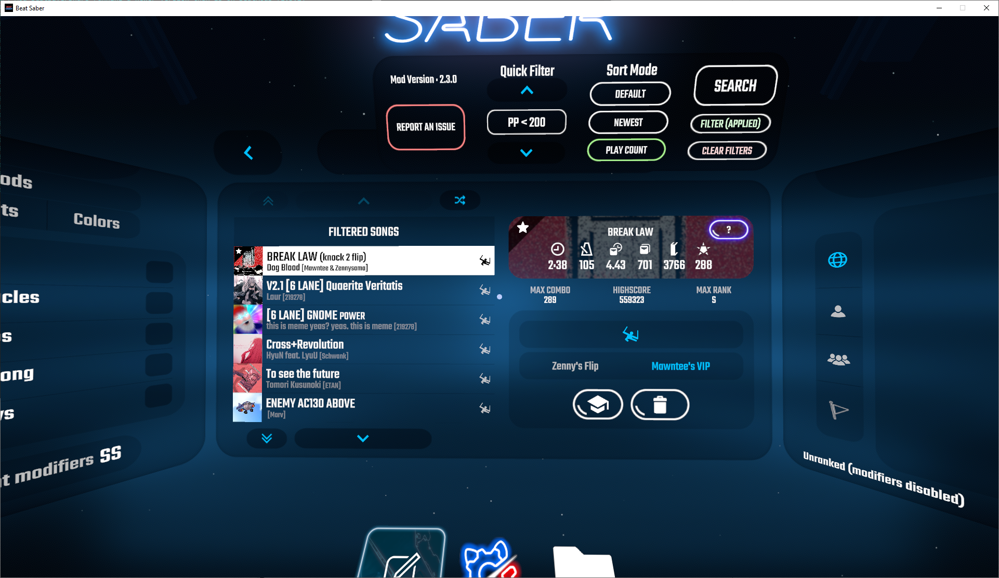

# Enhanced Search And Filters

A mod that helps you find the songs you want to play quicker! Includes a more option-rich search screen and song filtering. The latest version of this mod can be found [here](https://github.com/chrislee0419/EnhancedSearchAndFilters/releases).

### Have an issue?

_**If you have any suggestions or found any bugs**_, please report it [here](https://github.com/chrislee0419/EnhancedSearchAndFilters/issues) or through Discord by sending a message to `chris#9068`.

## Features

- Song Sorting
     - Sort your songs by how recently you downloaded it or by your play count
- Search
     - Auto-refreshing search results
       - Now you don't have to enter the whole title of a song and hope it appears in the search results! You can see what songs match as you're typing it in.
     - Search by song title, author, and map maker
       - Never search for artists or map makers? Further refine your search results when you disable searching in those fields.
     - Symbols
       - Apostrophes, quotation marks, commas, brackets, etc. can be removed before searching.
       - Or alternatively, symbols can be typed in yourself when trying to find a song with lots of symbols in the title!
     - Word suggestions
       - While typing, the mod shows you a list of possible words you're trying to type.
- Filter
     - Limit song length, difficulties, and NJS on the song list.
     - One Saber, No Arrows, 90/360 Degree, Lightshow, and Mapping Extensions-required songs can be easily found!
     - Show only ranked songs (requires the SongDataCore mod).
     - Frequently download songs and then forget to play them? Filter for songs that you have never played before.
     - Looking to full combo all your songs? Find all the songs that you have yet to full combo!
- Mod compatibility
     - Compatible with [SongBrowser](https://github.com/halsafar/BeatSaberSongBrowser) and [SongDataCore](https://github.com/halsafar/BeatSaberSongDataCore).

## Dependencies

- [SongCore](https://github.com/Kylemc1413/SongCore)
- [BS Utils](https://github.com/Kylemc1413/Beat-Saber-Utils)
- [BeatSaberMarkupLanguage (BSML)](https://github.com/monkeymanboy/BeatSaberMarkupLanguage)
- [(Optional) SongDataCore](https://github.com/halsafar/BeatSaberSongDataCore)

## Screenshots

## Icon Credits

Checkmark icon made by [Silviu Runceanu](https://www.flaticon.com/authors/silviu-runceanu) on [www.flaticon.com](https://www.flaticon.com/), modified with colours inverted (licensed under [CC BY 3.0](https://creativecommons.org/licenses/by/3.0/legalcode)).

Cross icon made by [Silviu Runceanu](https://www.flaticon.com/authors/silviu-runceanu) on [www.flaticon.com](https://www.flaticon.com/), modified with colours inverted (licensed under [CC BY 3.0](https://creativecommons.org/licenses/by/3.0/legalcode)).

Garbage can icon made by [Those Icons](https://www.flaticon.com/authors/those-icons) from [www.flaticon.com](https://www.flaticon.com/) (modified with colours inverted and gap widened).

Shuffle icon made by [Freepik](https://www.flaticon.com/authors/freepik) from [www.flaticon.com](https://www.flaticon.com/).